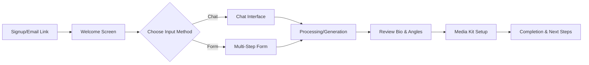

# Client Onboarding Workflow Plan

## Overview
Transform the existing Guest Profile Setup into an automatic, full-screen onboarding experience that launches when:
- A new user signs up (client role)
- An admin creates a campaign for a client

## Core Principles
- **No reinvention**: Leverage existing ProfileSetup, Questionnaire, and MediaKit components
- **Full-screen experience**: Modern, immersive interface similar to Stripe/Notion onboarding
- **Automatic triggers**: Seamless entry into onboarding flow
- **Better flow**: Smooth progression from chat/form → bio generation → media kit

## Technical Architecture

### 1. Email Trigger System (Backend-Driven)

The **backend** is responsible for sending onboarding emails in these scenarios:

#### A. New User Signup Flow
```python
# Backend: After successful user registration
def handle_user_signup(user_data):
    # 1. Create user account
    user = create_user(user_data)
    
    # 2. If client role, create initial campaign
    if user.role == 'client':
        campaign = create_initial_campaign(user)
        
        # 3. Send onboarding email
        send_onboarding_email(
            to=user.email,
            user_name=user.full_name,
            campaign_id=campaign.id,
            onboarding_token=generate_onboarding_token(user.id, campaign.id)
        )
```

#### B. Admin Creates Campaign for Client
```python
# Backend: When admin creates campaign
def create_campaign_for_client(admin_user, client_email, campaign_data):
    # 1. Create or find client user
    client_user = find_or_create_client(client_email)
    
    # 2. Create campaign
    campaign = create_campaign(client_user, campaign_data)
    
    # 3. Send onboarding email
    send_onboarding_email(
        to=client_email,
        user_name=client_user.full_name,
        campaign_id=campaign.id,
        onboarding_token=generate_onboarding_token(client_user.id, campaign.id),
        invited_by=admin_user.full_name
    )
```

#### C. Email Template Structure
```html
Subject: Welcome to PGL! Let's Set Up Your Podcast Guest Profile

Hi {user_name},

{invited_by_text}You're just 15 minutes away from having a professional podcast guest profile that will help you land amazing podcast interviews.

[Begin Setup] --> Links to: https://podcastguestlaunch.onrender.com/onboarding?token={onboarding_token}

This link will take you through:
✓ Quick profile questionnaire
✓ AI-powered bio generation
✓ Professional media kit creation

The link expires in 7 days. You can save and resume anytime.

Best,
The PGL Team
```

#### D. Frontend Onboarding Route Handler
```typescript
// Frontend: /onboarding route
const OnboardingPage = () => {
  const [searchParams] = useSearchParams();
  const token = searchParams.get('token');
  const navigate = useNavigate();
  
  useEffect(() => {
    // Validate token and get campaign info
    validateOnboardingToken(token)
      .then(({ campaignId, userId }) => {
        // Set auth if needed
        setAuthFromToken(token);
        // Start onboarding flow
        setOnboardingCampaign(campaignId);
      })
      .catch(() => {
        // Invalid/expired token
        navigate('/login?message=onboarding-link-expired');
      });
  }, [token]);
  
  return <OnboardingFlow />;
};
```

#### E. Token Security
```typescript
// Onboarding token contains:
interface OnboardingToken {
  userId: string;
  campaignId: string;
  expiresAt: Date; // 7 days from creation
  type: 'signup' | 'campaign_invite';
}
```

### 2. Full-Screen Onboarding Wrapper

Create `OnboardingFlow.tsx` that wraps existing components:

```typescript
interface OnboardingFlowProps {
  campaignId: string;
  onComplete: () => void;
}

const OnboardingFlow = () => {
  const [currentStep, setCurrentStep] = useState<
    'welcome' | 'questionnaire' | 'bio-generation' | 'media-kit' | 'complete'
  >('welcome');
  
  return (
    <div className="fixed inset-0 bg-white z-50 overflow-hidden">
      {/* Full-screen onboarding UI */}
    </div>
  );
};
```

### 3. Enhanced UI Components

#### A. Welcome Screen
- Full-screen hero with campaign name
- "Welcome, [Name]! Let's set up your podcast guest profile"
- Estimated time: 15-20 minutes
- Benefits preview (what they'll get)
- Single CTA: "Start Setup"

#### B. Enhanced Questionnaire Experience
- **Keep existing Questionnaire.tsx logic**
- Add full-screen wrapper with:
  - Minimal navigation (just logo + progress)
  - Larger typography for better readability
  - Floating progress indicator
  - Smooth section transitions
  - Exit confirmation dialog

#### C. Bio & Angles Generation Step
- Show processing animation while generating
- Live preview of generated content
- "Edit & Approve" interface
- Celebration animation on completion

#### D. Media Kit Finalization
- Full-screen media kit preview
- Upload headshot/logo in context
- One-click publish option
- Share link generation

#### E. Completion Screen
- Celebration animation
- Summary of what was created
- Next steps (3 clear actions)
- Option to view dashboard or share media kit

### 4. User Flow



### 5. Implementation Steps

#### Phase 1: Backend Email System (Week 1)
1. Create email service/utility for onboarding emails
2. Add onboarding token generation and validation endpoints
3. Modify user signup flow to trigger emails for clients
4. Add email trigger to campaign creation endpoint
5. Create email templates (HTML + text versions)

#### Phase 2: Frontend Onboarding Route & Wrapper (Week 2)
1. Create `/onboarding` route with token validation
2. Build `OnboardingFlow.tsx` wrapper component
3. Add full-screen styling and navigation guards
4. Implement welcome screen with campaign context
5. Handle expired/invalid token scenarios

#### Phase 3: Integration with Existing Components (Week 3)
1. Wrap `Questionnaire.tsx` in full-screen container
2. Enhance chat interface for full-screen mode
3. Add smooth transitions between steps
4. Implement progress persistence with auto-save
5. Add exit/resume functionality

#### Phase 4: Generation & Completion Flow (Week 4)
1. Create generation progress screen with animations
2. Build preview interfaces for bio/angles
3. Enhance media kit tab for onboarding context
4. Add completion celebration screen
5. Implement post-onboarding redirect to dashboard

### 6. Key Features

#### A. Smart Defaults
- Pre-fill name from user account
- Auto-detect LinkedIn from email domain
- Suggest expertise based on campaign type

#### B. Progress Persistence
- Save after each section
- Allow exit and resume
- Email reminders for incomplete onboarding

#### C. Contextual Help
- Tooltips for complex fields
- Example content for inspiration
- "Why we need this" explanations

#### D. Mobile Optimization
- Responsive full-screen layouts
- Touch-friendly inputs
- Appropriate keyboard types

### 7. Success Metrics

1. **Completion Rate**: Track % who finish onboarding
2. **Time to Complete**: Average completion time
3. **Drop-off Points**: Where users abandon
4. **Content Quality**: Word count and completeness

### 8. Technical Considerations

#### State Management
```typescript
interface OnboardingState {
  campaignId: string;
  currentStep: string;
  completedSteps: string[];
  questionnaireDraft: any;
  generatedContent: {
    bio?: string;
    angles?: string[];
    keywords?: string[];
  };
}
```

#### API Endpoints Utilized
- `POST /campaigns/{id}/submit-questionnaire`
- `POST /campaigns/{id}/generate-angles-bio`
- `PATCH /campaigns/{id}` (for keywords)
- `GET /campaigns/{id}/media-kit`

#### Component Reuse
- Use existing `Questionnaire.tsx` with wrapper
- Leverage `ChatInterface.tsx` as-is
- Extend `MediaKitTab.tsx` for onboarding
- Reuse all UI components (Button, Card, Progress, etc.)

### 9. Future Enhancements

1. **Onboarding Templates**: Pre-filled examples by industry
2. **Video Tutorials**: Embedded help videos
3. **AI Coach**: Real-time suggestions while filling
4. **Team Onboarding**: Bulk onboarding for agencies

### 10. Migration Strategy

1. **Soft Launch**: Enable for new signups only
2. **Gradual Rollout**: A/B test with % of users
3. **Feedback Collection**: In-app feedback widget
4. **Iteration**: Weekly improvements based on data

## Backend Requirements Summary

### Email Service Requirements
1. **Email Provider Integration** (SendGrid, AWS SES, etc.)
2. **Email Templates**:
   - Welcome email for new signups
   - Campaign invitation email from admin
   - Reminder emails for incomplete onboarding

### API Endpoints (Already Implemented)
1. **POST /auth/validate-onboarding-token**
   - Validates token and returns campaign/user info
   - Returns: person_id, campaign_id, email, full_name, email_verified

2. **POST /auth/complete-onboarding**
   - Marks onboarding as completed
   - Invalidates the token

3. **GET /auth/me**
   - Returns user info including onboarding_completed status

### Database Updates (Already Implemented)
1. ✅ Added `onboarding_completed` and `onboarding_completed_at` to people table
2. ✅ Created `onboarding_tokens` table with 7-day expiry
3. ✅ Token cleanup function for expired tokens

## Summary

This plan transforms the existing Guest Profile Setup into a modern, full-screen onboarding experience triggered by backend emails. The flow ensures that every new client receives a welcoming email that guides them directly into the onboarding process, creating a seamless experience from signup/invitation to completed profile.